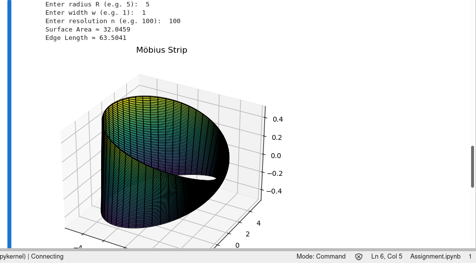

# Möbius Strip Modeling in Python

This project models a **Möbius strip** using parametric equations and computes key geometric properties such as surface area and edge length. It includes visualization, numerical integration, and a modular Python script.

## 🧮 Parametric Equation

The strip is defined by:

x(u,v) = (R + v * cos(u/2)) * cos(u)
y(u,v) = (R + v * cos(u/2)) * sin(u)
z(u,v) = v * sin(u/2)   


Where:

- `u ∈ [0, 2π]`
- `v ∈ [−w/2, w/2]`

## 📦 Requirements

- Python 3.x
- NumPy
- Matplotlib
- SciPy

Install dependencies using:

```bash
pip install numpy matplotlib scipy

📂 Files

    Assignment.ipynb – Main Jupyter notebook containing code, explanation, and results

    README.md – Project description (this file)

🛠️ Features

    Generates a 3D mesh of the Möbius strip

    Computes:

        Surface area (approximate)

        Edge length (numerical)

    Visualizes the surface in 3D


▶️ How to Run

You can open and run the Jupyter Notebook:

jupyter notebook Assignment.ipynb

Or use JupyterLab:

jupyter lab Assignment.ipynb

📊 Output

    Interactive 3D plot of the Möbius strip

    Surface area value

    Edge length value


